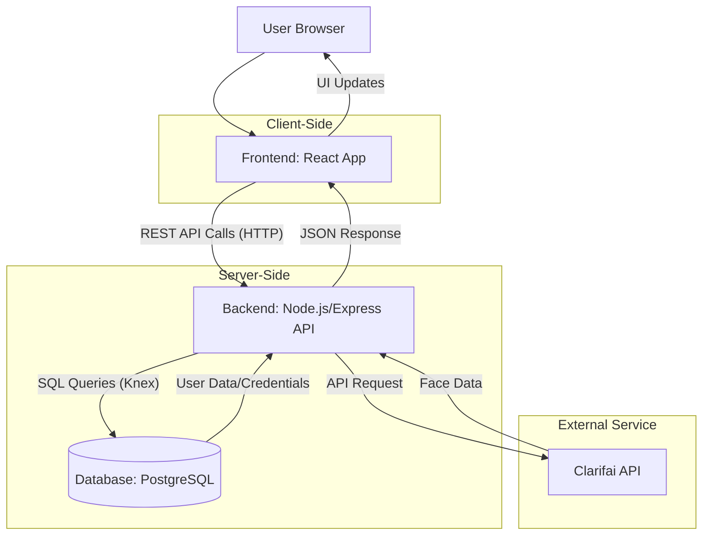

# SmartBrain Application Architecture

This document outlines the architecture of the SmartBrain project, covering the system design, components, data flow, and key design decisions.

## 1. System Architecture

SmartBrain employs a standard **Client-Server Architecture**.

- **Client (Frontend):** A React-based Single Page Application (SPA) running in the user's web browser. It handles the user interface, user interactions, and communicates with the backend API.
- **Server (Backend):** A Node.js/Express application acting as a RESTful API. It manages business logic (user authentication, interaction with external services), data persistence (connecting to the database), and serves data to the frontend.
- **Database:** A PostgreSQL relational database storing user information (credentials, profile data, submission counts).
- **External Service:** The Clarifai API is used for the core face detection functionality. The backend API acts as an intermediary between the frontend and Clarifai.



## 2. Project Folder Structure

The project is organized into two main directories within the root `smartbrain-project`:

```
smartbrain-project/
├── smart-brain/                # Frontend React Application Root
│   ├── public/                 # Static assets and index.html
│   ├── src/                    # React app source code
│   │   ├── components/         # Reusable UI components
│   │   │   ├── FaceRecognition/  # Component to display image and boxes
│   │   │   ├── ImageLinkForm/    # Input form for image URL
│   │   │   ├── Logo/             # Animated logo component
│   │   │   ├── Navigation/       # Top navigation links (Sign In/Out, Register)
│   │   │   ├── Rank/             # Displays user's entry count
│   │   │   ├── Register/         # User registration form component
│   │   │   └── Signin/           # User sign-in form component
│   │   ├── App.js              # Main application component, state management, routing logic
│   │   ├── index.js            # Entry point for the React app
│   │   └── ...                 # Other React files (CSS, tests)
│   ├── package.json            # Frontend dependencies and scripts
│   ├── .env                    # Environment variables (optional for CRA)
│   ├── sql queries.txt         # SQL schema definition
│   └── README.md               # Frontend specific readme (minimal)
│
└── smart-brain-api/            # Backend Node.js/Express API Root
    ├── controllers/            # Request handlers for different routes
    │   ├── image.js            # Handles image submission and Clarifai API call
    │   ├── profile.js          # Handles user profile retrieval
    │   ├── register.js         # Handles user registration logic
    │   └── signin.js           # Handles user sign-in logic
    ├── server.js               # API server entry point, middleware setup, route definitions
    ├── package.json            # Backend dependencies and scripts
    ├── .env                    # Environment variables (DB credentials, API keys) - MUST BE CREATED
    └── README.md               # Backend specific readme (minimal)
```

## 3. Major Components

### Frontend (`smart-brain`)

- **`App.js`**: The main component orchestrating the application. It manages the overall state (current user, input URL, image URL, face boxes, current route), handles routing between Signin, Register, and Home screens, and passes data and callbacks down to child components.
- **`Navigation.js`**: Displays conditional navigation links ("Sign In", "Register", or "Sign Out") based on the user's authentication state (`isSignedIn`).
- **`Signin.js`**: Class component handling the sign-in form. It captures user input (email, password) and makes an API call to the `/signin` endpoint upon submission. Loads user data on success.
- **`Register.js`**: Class component handling the registration form. Captures user input (name, email, password) and makes an API call to the `/register` endpoint. Loads user data on success.
- **`Logo.js`**: Displays the application logo with a tilt effect.
- **`Rank.js`**: Displays the logged-in user's name and their current submission count (`entries`).
- **`ImageLinkForm.js`**: Provides the input field for the image URL and the "Detect" button. Passes input changes and submission events up to `App.js`.
- **`FaceRecognition.js`**: Displays the submitted image and overlays the bounding boxes calculated based on the Clarifai API response.

### Backend (`smart-brain-api`)

- **`server.js`**:
  - Initializes the Express application.
  - Configures middleware: `cors` for handling cross-origin requests, `body-parser` (via `express.json()`) for parsing JSON request bodies.
  - Establishes database connection using `knex` and credentials from `.env`.
  - Defines API routes (`/signin`, `/register`, `/profile/:id`, `/image`, `/imageurl`) and maps them to controller functions.
  - Starts the HTTP server to listen for incoming requests.
- **Controllers**: Modules responsible for handling the logic for specific endpoints.
  - **`signin.js`**: Handles POST requests to `/signin`. Validates input, queries the database for the user and password hash, compares the hash using `bcrypt`, and returns user data if valid.
  - **`register.js`**: Handles POST requests to `/register`. Validates input, hashes the password using `bcrypt`, inserts new user records into the `login` and `users` tables within a transaction, and returns the newly created user data.
  - **`profile.js`**: Handles GET requests to `/profile/:id`. Queries the database for user details based on the provided ID.
  - **`image.js`**:
    - `handleApiCall`: Handles POST requests to `/imageurl`. Takes an image URL, calls the Clarifai 'face-detection' model via the Clarifai client, and forwards the response.
    - `handleImage`: Handles PUT requests to `/image`. Increments the `entries` count for the given user ID in the database and returns the updated count.
- **Database Interaction**: Performed via the `knex` instance (`db`) initialized in `server.js` and passed to the controllers. Knex is used to build and execute SQL queries against the PostgreSQL database.
- **Authentication**: Uses `bcrypt-nodejs` for hashing passwords during registration (`hashSync`) and comparing them during sign-in (`compareSync`).

## 4. Data Flow

### User Registration

1.  **Frontend:** User fills out name, email, password in `Register.js` and clicks "Register".
2.  **Frontend:** `Register.js` sends a POST request to `http://localhost:8000/register` with the user data in the request body.
3.  **Backend:** `server.js` routes the request to `register.handleRegister`.
4.  **Backend:** Controller validates input, hashes the password using `bcrypt`.
5.  **Backend:** Controller uses `knex` to start a database transaction:
    - Inserts email and hash into the `login` table.
    - Inserts name, email, and join date into the `users` table.
6.  **Backend:** If the transaction succeeds, it commits and sends back the new user data (from the `users` table) as a JSON response.
7.  **Frontend:** `Register.js` receives the user data, calls `loadUser` in `App.js` to update the state, and `onRouteChange('home')` navigates to the main app page.

### User Sign In

1.  **Frontend:** User fills out email, password in `Signin.js` and clicks "Sign in".
2.  **Frontend:** `Signin.js` sends a POST request to `http://localhost:8000/signin` with credentials.
3.  **Backend:** `server.js` routes the request to `signin.handleSignin`.
4.  **Backend:** Controller validates input. Queries the `login` table for the user's email to get the stored hash.
5.  **Backend:** Compares the provided password with the stored hash using `bcrypt.compareSync`.
6.  **Backend:** If passwords match, queries the `users` table for the full user profile using the email.
7.  **Backend:** Sends the user profile data as a JSON response.
8.  **Frontend:** `Signin.js` receives the user data, calls `loadUser` in `App.js`, and `onRouteChange('home')`.

### Face Detection

1.  **Frontend:** User pastes an image URL into `ImageLinkForm.js` and clicks "Detect".
2.  **Frontend:** `App.js` updates its state with the input URL (`onInputChange`) and triggers `onButtonSubmit`.
3.  **Frontend (`onButtonSubmit`):**
    - Sets the `imageUrl` state to display the image.
    - Sends a POST request to `http://localhost:8000/imageurl` with `{ input: imageURL }`.
4.  **Backend:** `server.js` routes to `image.handleApiCall`.
5.  **Backend (`handleApiCall`):** Sends the URL to the Clarifai API's face detection model.
6.  **Clarifai API:** Processes the image and returns data including bounding box coordinates for detected faces.
7.  **Backend:** Receives the Clarifai response and forwards it back to the frontend.
8.  **Frontend (`onButtonSubmit` - `.then` block of first fetch):**
    - Receives the Clarifai data.
    - Sends a PUT request to `http://localhost:8000/image` with `{ id: userId }`.
9.  **Backend:** `server.js` routes to `image.handleImage`.
10. **Backend (`handleImage`):** Increments the `entries` count for the user ID in the `users` table using `knex`. Returns the new entry count.
11. **Frontend (`onButtonSubmit` - `.then` block of second fetch):**
    - Receives the updated entry count.
    - Updates the user state: `this.setState(Object.assign(this.state.user, { entries: count }))`.
12. **Frontend (`onButtonSubmit` - continued):**
    - Calls `calculateFaceLocation` using the Clarifai data to convert coordinates relative to the image dimensions.
    - Calls `displayFaceBox` which updates the `box` state in `App.js`.
13. **Frontend:** `FaceRecognition.js` re-renders, displaying the image (`imageUrl`) and the bounding box (`box` state). `Rank.js` re-renders with the updated entry count.

## 5. Design Decisions

- **Frontend/Backend Separation:** Creates a clear division between presentation logic (React) and business/data logic (Node API). Allows independent development, scaling, and potentially swapping out technologies on either side.
- **React:** Chosen for its component-based architecture, efficient rendering (Virtual DOM), and large ecosystem, suitable for building interactive UIs.
- **Node.js/Express:** Common choice for building REST APIs due to its speed, non-blocking I/O, JavaScript ecosystem (allowing full-stack JS), and simplicity.
- **PostgreSQL:** A robust, open-source relational database suitable for storing structured user data and handling relations.
- **Knex.js:** A SQL query builder that simplifies database interactions in Node.js, supports multiple SQL dialects (including PostgreSQL), and helps prevent SQL injection vulnerabilities compared to raw string concatenation.
- **Bcrypt:** Industry standard for password hashing. It's slow and includes a salt, making brute-force and rainbow table attacks much harder.
- **Clarifai API:** Offloads the complex Machine Learning task of face detection to a specialized external service, avoiding the need to build and maintain an ML model within the project itself.
- **RESTful API:** Using standard HTTP methods (GET, POST, PUT) and status codes provides a conventional way for the frontend and backend to communicate.
- **State Management in `App.js`:** For this application's scale, lifting state up to the main `App.js` component and passing data/callbacks down is sufficient. For larger apps, a dedicated state management library (Redux, Zustand) might be considered.
- **Environment Variables (`.env`):** Standard practice for managing sensitive configuration (API keys, DB credentials) separately from the codebase.
